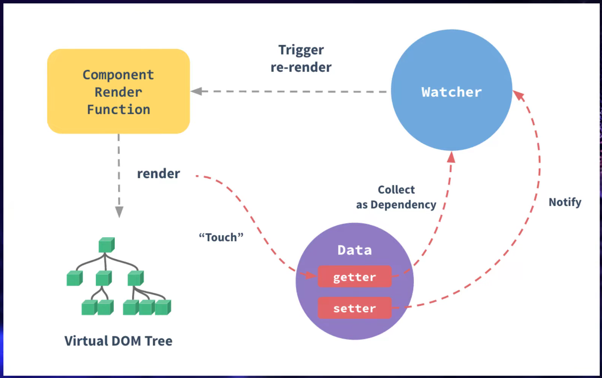

Que es Vue

vue es una libreria, un framework de trabajo que nos va a permitir la realizacion de interfaces reactivas

Vue funciona con un virual dom (dom virtual), esto que es cuando nosotros trabajamos en el navegador, todo lo que cosntruimos se contuye atraves del dom

vue trabaja con un virtual dom

Forma de crear un proyecto con el gestor de vue

vue create NOMBRE_PROYECTO
